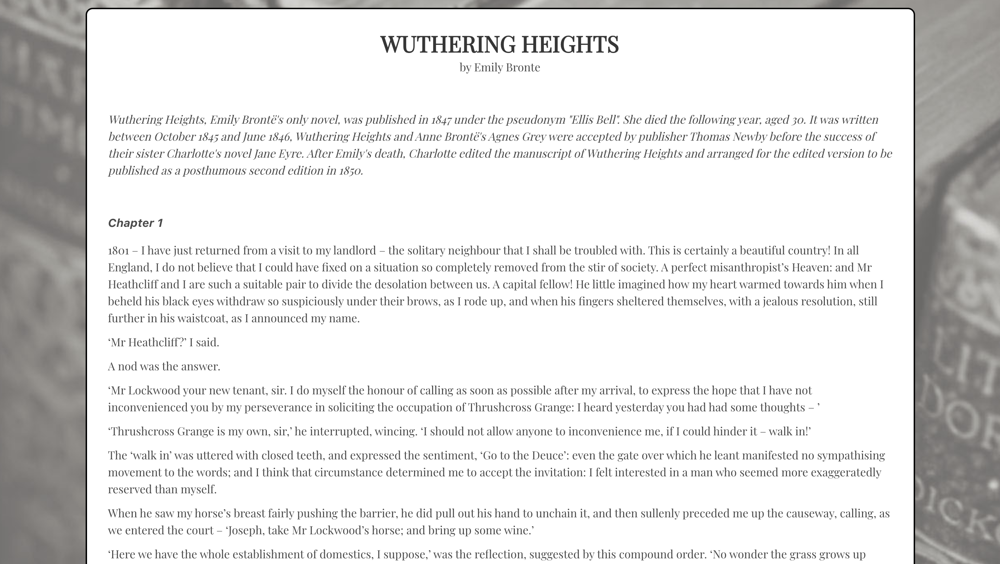

#Britain By The Book
--------------
* [View app on Heroku](https://britainbythebook.herokuapp.com/)
* [View repository on GitHub](https://github.com/Petemab/vue.js_hackathon)

An app built with Vue.js and Node.js, produced in a two-day hackathon by Pete Bennett and Stephanie Ye. Prior to this project, we had never used Vue.js.

##Description
-------------
Britain By The Book is an app that allows book lovers to record where in the UK their favourite books are set.

The main page is a giant map displaying all currently pinned places.

To create a new pin, the user enters a book title and a place name.

Clicking on the pin brings the user to a page with information about both the place and the book:
* The Google Maps API returns the place location and a photo of the place.
* The Wikipedia API returns a short description of the place and a note about the book.
* The Pan Macmillan API returns a short excerpt (usually the first chapter) of the book.

##Approach
----------
Concept
* Due to the short project window (two days) and our lack of familiarity with Vue.js, we decided to base the project around an API we were already familiar with, Google Maps. We also wanted to do something related to books as we both have degrees in English literature. Once we discovered the Pan Macmillan API, which provides excerpts from books in their catalogue, we decided to create an app that allows a user to map where various books are set.

Task Management
* As it was a hackathon, we pretty much just plunged straight in. However, we did make sure to set up a solid backend first, as we were already familiar with Node.js.
* At the frontend, Pete handled the CSS and Stephanie handled the APIs. Although Vue.js was completely new to us, our familiarity with AngularJS and React meant that we were able to do a basic app with Vue.js fairly smoothly.

##Challenges
-----------------
* As it was a hackathon, we did not have time to fully comes to grips with Vue.js, and there are many features of the framework we have yet to explore and understand.
* We also did not have time to fully research APIs and just went with what we could easily find. While we appreciate the Pan Macmillan API, using it obviously limits the books that can be added to titles published by that house (at least, if you want an excerpt!). Fortunately, they do have a comprehensive range of the classics in their catalogue.
* Unfortunately, the Google Maps API photo URL is temporary and becomes invalid after a few days, returning an ugly generic image. One option would be to allow the user to update the entry with their own photo URL.
* The Wikipedia API is unfortunately not comprehensive and does not offer all the entries in the Wikipedia database, so sometimes no place information or book information is returned.

##Technologies
--------------
Languages:
* HTML5
* Sass/CSS
* JavaScript

Front-end Web Application Framework:
* Vue.js

Server Environment
* Node.js with Express.js

CSS Framework:
* Bulma

Third-party APIs
* Google Maps
* Wikipedia
* Pan Macmillan

REST client
* Insomnia

Typefaces:
* Google Fonts

Text Editor:
* Atom

Browser:
* Chrome

##Contact
---------
Pete Bennett
* petemabennett@gmail.com
* www.petemabennett.com

Stephanie Ye
* hello@stephanieye.com
* www.stephanieye.com
